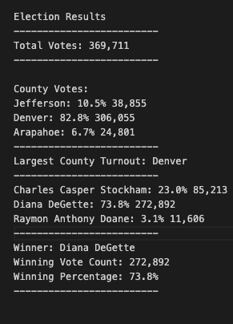

# Election Analysis

## Overview of Election Audit
The goal of this project was to assist a hypothetical Colorado Board of Election employee, Tom, who's intent was to figure out if Python could be used to tally the election results of a congressional election. Usually, Excel is used, but if the script works more efficiently for this campaign, and it can be applied to others easily, it could be used in the future. The results required by the board were as follows:

1.  Calculate the total number of votes cast.
2.  Get a complete list of candidates who recieved votes.
3.  Calculate the total number of votes each candidate received.
4.  Calculate the percentage of votes each candidate won.
5.  Determine the Winner of the election based on popular vote.

## Election Audit Results
This is an example of the data:
<p align = "center">
    <br>
  <a href = "/Resources/election_results.csv">clcik here to go to data set</a>
</p>

The file is actually a csv, so this image is just a visualization tool in this case.  There are 3 sections, the ballot ID, the county and the candidate that voter chose.  The snapshot shows the transition between different counties to describe what must be done in order to sort the data.

The first steps were to import dependencies and initialize various variables, lists and directories that were need for the rest of the steps.  They will be further explained, but to see them initialized, <a href = "PyPoll_Challenge.py">click here</a>. Next, was to read the data and convert it into 2 lists of dictionaries: one for the vote count for each candidate and one fore the vote count for each county. This required 2 if-statements within a for loop iterating through each row.  The if-statements check to see if the candidate or county name has been added to their respective lists.  If not, the name, and one vote for that name is added to their respective dictionaries. The commented code is as follows:

```
  for row in reader:

          # Add to the total vote count
          total_votes = total_votes + 1

          # Get the candidate name from each row.
          candidate_name = row[2]

          # Extract the county name from each row.
          county_name = row[1]

          # If the candidate does not match any existing candidate add it to
          # the candidate list
          if candidate_name not in candidate_options:

              # Add the candidate name to the candidate list.
              candidate_options.append(candidate_name)

              # And begin tracking that candidate's voter count.
              candidate_votes[candidate_name] = 0

          # Add a vote to that candidate's count
          candidate_votes[candidate_name] += 1

          # Write an if statement that checks that the
          # county does not match any existing county in the county list.
          if county_name not in counties:

              # Add the existing county to the list of counties.
              counties.append(county_name)

              # Begin tracking the county's vote count.
              county_votes[county_name] = 0

          # Add a vote to that county's vote count.
          county_votes[county_name] += 1
```
With the data gathered into dictionaries, it was then printed to the terminal for verification, and to a txt file to easily visualize the results for other users.  After opening the text file to write to, the total votes were printed:
```
  with open(file_to_save, "w") as txt_file:

    # Print the final vote count (to terminal)
    election_results = (
        f"\nElection Results\n"
        f"-------------------------\n"
        f"Total Votes: {total_votes:,}\n"
        f"-------------------------\n\n"
        f"County Votes:\n")
    print(election_results, end="")

    txt_file.write(election_results)
```
The a for loop was created to iterate through the county votes dictionary to print the name, percentage of votes and vote count for each county and find which county had the highest turnout.  This was done with an if-statement that checked whether the current county values were higher then the last for each iteration.  If so, the name and number of votes were saved as the highest county vote variables.

```
  for county_name in county_votes:
        # Retrieve the county vote count.
        votes = county_votes.get(county_name)
        
        # Calculate the percentage of votes for the county.
        vote_percentage = float(votes) / float(total_votes) * 100

        # Print the county results to the terminal.
        county_results = (
            f"{county_name}: {vote_percentage:.1f}% {votes:,}\n"
        )
        print(county_results)
        # Save the county votes to a text file.
        txt_file.write(county_results)
        # Write an if statement to determine the winning county and get its vote count.
        if(votes > county_most_votes):
            county_most_votes = votes
            county_most_name = county_name
```
Then the highest county turnout summary was printed to the text file.

```
  # Print the county with the largest turnout to the terminal.
    high_turnout_summary = (
        f"-------------------------\n"
        f"Largest County Turnout: {county_most_name}\n"
        f"-------------------------\n"
    )
    print(high_turnout_summary)
    # Save the county with the largest turnout to a text file.
    txt_file.write(high_turnout_summary)
```
And another for loop was created to capture and print the names, percentage of votes  and count of votes to the text file.  This for loop included a similarly structured if-statement as the highest county turnout.  It checked to see whther current amount was higher than the previous iteration adn saved it if it was as the winning numbers.

```
    for candidate_name in candidate_votes:

        # Retrieve vote count and percentage
        votes = candidate_votes.get(candidate_name)
        vote_percentage = float(votes) / float(total_votes) * 100
        candidate_results = (
            f"{candidate_name}: {vote_percentage:.1f}% {votes:,}\n")

        # Print each candidate's voter count and percentage to the
        # terminal.
        print(candidate_results)
        #  Save the candidate results to our text file.
        txt_file.write(candidate_results)

        # Determine winning vote count, winning percentage, and candidate.
        if (votes > winning_count) and (vote_percentage > winning_percentage):
            winning_count = votes
            winning_candidate = candidate_name
            winning_percentage = vote_percentage
```
The final step was to print the information of the candidate who won the election to the console and the text file.
```
    # Print the winning candidate (to terminal)
    winning_candidate_summary = (
        f"-------------------------\n"
        f"Winner: {winning_candidate}\n"
        f"Winning Vote Count: {winning_count:,}\n"
        f"Winning Percentage: {winning_percentage:.1f}%\n"
        f"-------------------------\n")
    print(winning_candidate_summary)

    # Save the winning candidate's name to the text file
    txt_file.write(winning_candidate_summary)
```
The final text file was as follows:
<p align = "center">
  <br>
  Click <a href = "analysis/election_analysis.txt">here </a> to go to output text file.
 </p>
 
The results of the analysis:
<ul>
  <li> There were 369,711 votes cast in the election</li>
  <li> The counties were:
    <ul>
      <li>Jefferson</li>
      <li>Denver</li>
      <li>Arapahoe</li>
    </ul>
  </li>
  <li> The county results were:
    <ul>
      <li>Jefferson had 10.5% of the votes cast with 38,855 total votes</li>
      <li>Denver had 82.8%% of the votes cast with 306,055 total votes</li>
      <li>Arapahoe had 6.7% of the votes cast with 24,801 total votes</li>
    </ul>
  </li>
  <li>Denver had the largest county turnout</li>
  <li> The candidates were:
    <ul>
      <li>Charles Casper Stockham</li>
      <li>Diana DeGette</li>
      <li>Raymon Anthony Doane</li>
    </ul>
  </li>
  <li> The candidate results were:
    <ul>
      <li>Charles Casper Stockham recieved 23.0% of the vote with 85,213 votes</li>
      <li>Diana DeGette recieved 73.8% of the vote with 272,892 votes</li>
      <li>Raymon Anthony Doane recieved 3.1% of the vote with 11,606 votes</li>
    </ul>
  </li>
  <li>Diana DeGette won the election with 272,892 votes which was 73.8% of the total votes cast</li>
</ul>

## Election Audit Summary
### Could this code be adapted for any election?
Yes, there are only two lines that would need to be edited for each time the script was used: the file that the data was sourced from and the file the text should be printed to.  These can be accessed in lines 7 and 8 in the <a href = "PyPoll_Challenge.py">PyPoll_Challenge.py</a> file.  The basic format of the file is:
<p align = "center">
  file_to_load = os.path.join("filename1", "filename2","...")
</p>
Usually a file path is written with / seperating the file names, but in this case it's quotes.  The only edit that would need to occur is to alter that file path. Obviously, an exceptionally important aspect for this to work for other elections is using the same formatting for the data set itself as well.

### What could be added?
To obtain more insight into the election, it may be beneficial to get the votes for each candidate *for each county*.  DeGette recieved 73.8% of the total votes.  Although this could easily imply that she is by farthe most popular candidate, Denver had the highest turnout with 82.8% of the total votes.  Since Denver is a larger city, it could mean that shes most popular there. Although this script works perfectly for providing the winner of an election, it could easily be adapted to include more information about the diversity of opinion in different sized counties.
  

